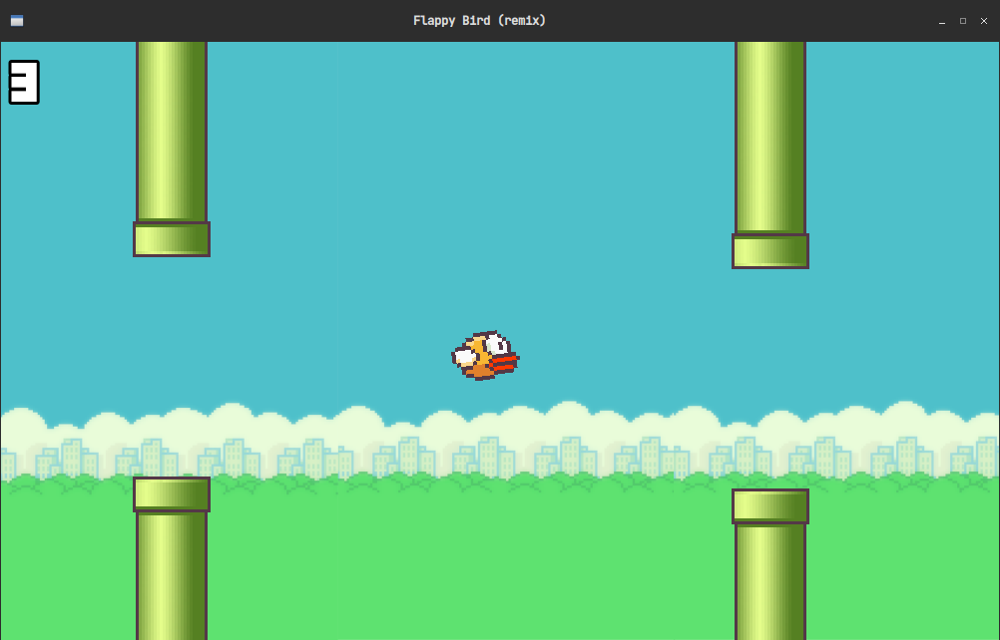
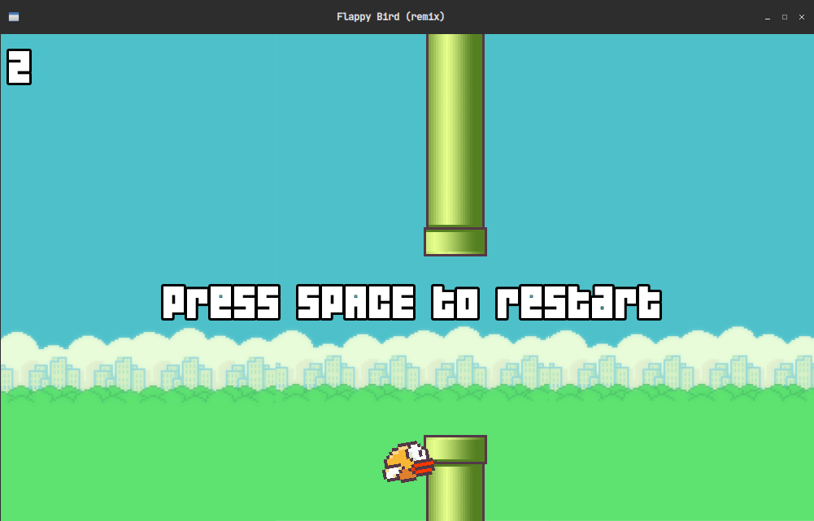

# Flappy Bird (remix)
The famous game made with C++ and SFML

---

# Dependencies
+ [g++](https://github.com/gcc-mirror/gcc)
+ [SFML](https://github.com/SFML/SFML/)
+ [Make](https://github.com/wkusnierczyk/make)

---

# Building and Run

```bash
git clone https://github.com/terroo/flappybird
cd flappybird
make
```

---

# Screenshots

 

 

---

Game made in the video tutorial: <https://youtu.be/lPDl6ul8-wg>
